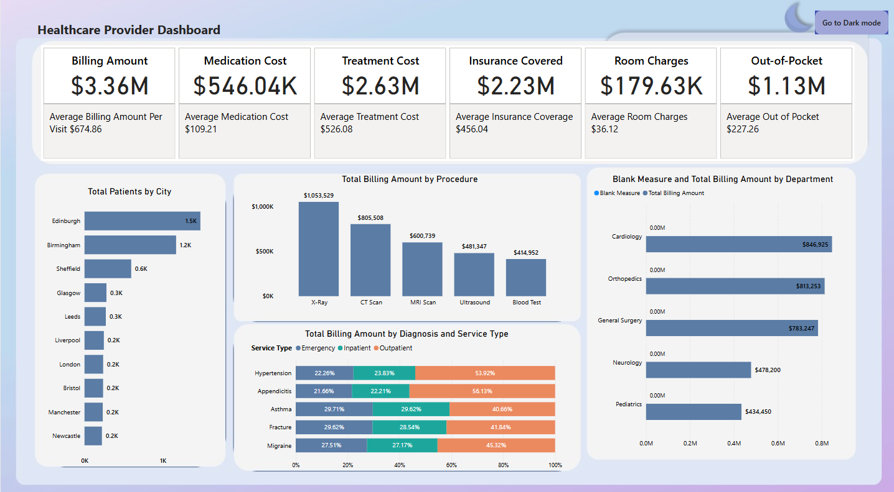
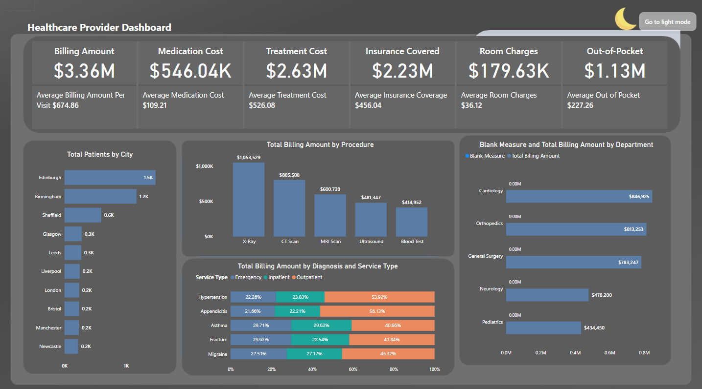

# PowerBI-Healthcare-Analysis
In this repo i analysed the heathcare data and created dashboard in powerbi

# Healthcare Power BI Dashboard

A dynamic and interactive Healthcare Dashboard built using Power BI, designed to provide deep insights into patient visits, departments, diagnosis, procedures, and insurance trends.

## 🩺 Project Summary

This dashboard leverages multiple tables:
- **Cities**
- **Departments**
- **Diagnosis**
- **Insurance**
- **Patients**
- **Procedures**
- **Providers**
- **Visits**

## ⚙️ Key Features

- Interactive **charts**, **slicers**, and **buttons**
- Functional **Light and Dark themes**
- Utilized **DAX queries**, **measures**, and **calculated columns**
- Seamless navigation for better storytelling and exploration
- Clean data modeling with proper relationships

## 📊 Dashboard Screenshots

### Light Theme

### Dark Theme

## 🧠 Skills Applied

- Power BI Data Modeling
- DAX for advanced metrics
- UI/UX Design (Themes, Buttons, and Navigation)
- Data Visualization best practices
- Data Relationship building

## 📁 File

- `Dashboard.pbix` – Power BI file with all data modeling, measures, and visuals.

## 📌 Use Cases

- Monitoring patient visits across departments
- Understanding insurance claim patterns
- Evaluating provider performance
- Analyzing diagnosis and procedures per city/department

---

Feel free to explore and suggest improvements. ⭐
